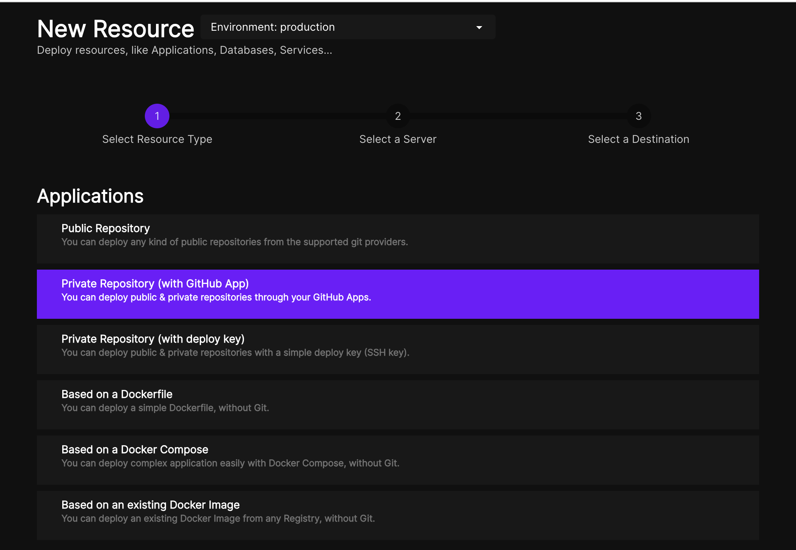
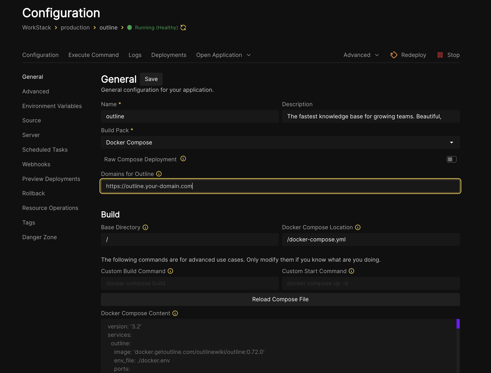

# Run Outline on Coolify

Coolify is an awesome way to make self-hosting a breeze. However, Outline doesn't come supported out-of-box. Here's a simple way to get it up and running.

> ⚠️ This is tested, but not for fully production-level environments. Use on your own risk!

## Parent Tutorial
This repo was made using the official Outline docs: https://docs.getoutline.com/s/hosting/doc/docker-7pfeLP5a8t

We recommend you read that before proceeding further.

### Notes
1. We don't need the https-portal, as Coolify already manages that for us
2. We will use the container names instead of "localhost", as we're using Docker Compose

## How to set it up:
1. Use this template repo to make a private repo for yourself
2. Import that repo into Coolify (preferably as a Private GitHub Repository)

3. Configure the settings accordingly. Give it an appropriate domain name (if you're using FQDN).

4. Edit `docker.env` to your liking (to learn more, refer again to the official Outline [docs](https://docs.getoutline.com/s/hosting/doc/docker-7pfeLP5a8t)). Make sure to use your FQDN in there.
5. Once deployed, (referring back to the official Outline docs) to run the migrations commands and such, you can use the "Execute Command" tab of Coolify.